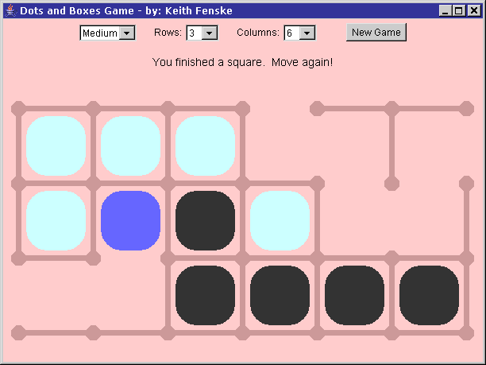

### Dots and Boxes Game (Java)

by: Keith Fenske, https://kwfenske.github.io/

DotsAndBoxes is an old Java 1.1 AWT (GUI) applet to play the pencil-and-paper
game of "Dots and Boxes", also known as "Lines and Boxes". The game board is a
rectangular grid. Dots are shown for the corners of the board squares. Players
take turns drawing the lines that surround each square: top, left, right, and
bottom. The player who completes a square by clicking on the fourth line gets
that square. At the end of the game, the player with the most squares wins.

The program's comments and documentation reference web sites that no longer
exist, and discuss differences in Java versions that are now meaningless. No
changes will be considered. Web page applets are obsolete and may run as
stand-alone applications with the help of a wrapper (included). This becomes
less likely after Java 9 (2017). Rewriting for Java Swing or newer JavaFX is
not an easy job.

Download the ZIP file here: https://kwfenske.github.io/dots-and-boxes-game-java.zip

Released under the terms and conditions of the GNU General Public License,
version 3 or later (GPLv3+). Permission is hereby granted to convert this web
page applet to the Apache License (version 2.0 or later) or to GNU GPLv2.

